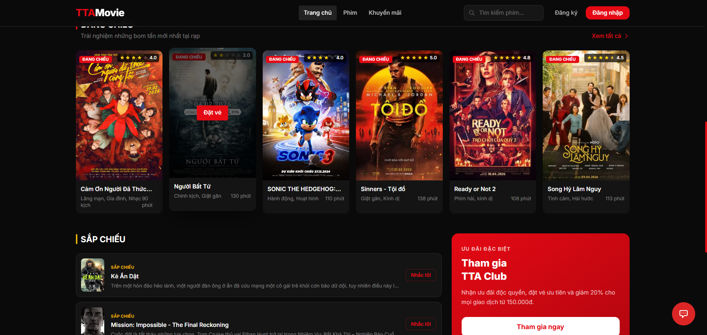
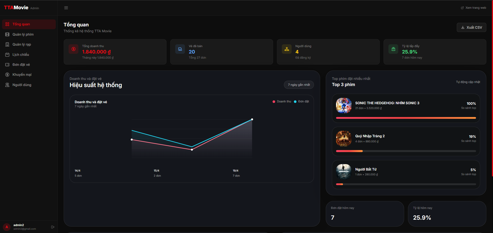
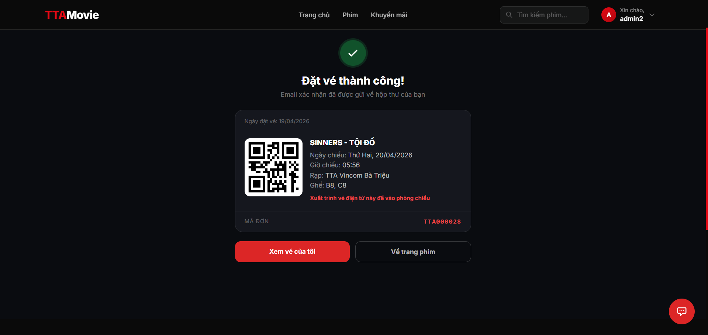

# 🎬 MovieBooking - Hệ thống đặt vé xem phim trực tuyến

Ứng dụng web đặt vé xem phim full-stack với backend ASP.NET Core 8 và frontend React 19.

---

## ✨ Tính năng

### Người dùng
- Đăng ký / Đăng nhập (JWT Authentication)
- Xem danh sách phim đang chiếu
- Xem chi tiết phim, lịch chiếu, sơ đồ ghế
- Đặt vé (chọn nhiều ghế)
- Thanh toán qua **VNPay** hoặc **chuyển khoản ngân hàng**
- Xem lịch sử đặt vé, hủy vé
- Chat hỗ trợ với AI (Google Gemini)

### Admin
- Quản lý phim (CRUD)
- Quản lý rạp, phòng chiếu, ghế
- Quản lý lịch chiếu
- Quản lý khuyến mãi
- Quản lý người dùng
- Xuất báo cáo Excel

---

## 🛠 Tech Stack

### Backend
| Công nghệ | Phiên bản |
|-----------|-----------|
| .NET / ASP.NET Core | 8.0 |
| Entity Framework Core | 8.0.23 |
| SQL Server | - |
| JWT Bearer Authentication | 8.0.23 |
| AutoMapper | 13.0.1 |
| FluentValidation | 11.9.0 |
| Swagger / OpenAPI | 6.6.2 |
| MailKit (Email) | 4.15.1 |
| ClosedXML (Excel) | 0.105.0 |

### Frontend
| Công nghệ | Phiên bản |
|-----------|-----------|
| React | 19.2.4 |
| Vite | 8.0.0 |
| React Router DOM | 7.13.1 |
| Axios | 1.13.6 |
| Tailwind CSS | 3.4.19 |

### Tích hợp bên thứ ba
- **VNPay** — Cổng thanh toán trực tuyến
- **Google Gemini AI** — Chatbot hỗ trợ khách hàng
- **Gmail SMTP** — Gửi email xác nhận đặt vé

---

## 🏗 Kiến trúc

Backend sử dụng **Clean Architecture** với 4 layer:

```
┌─────────────────────────────────────┐
│           MovieBooking.Api          │  ← Controllers, Middlewares, DI
├─────────────────────────────────────┤
│       MovieBooking.Application      │  ← DTOs, Interfaces, Validators, Mappings
├─────────────────────────────────────┤
│      MovieBooking.Infrastructure    │  ← Repositories, Services, DbContext
├─────────────────────────────────────┤
│         MovieBooking.Domain         │  ← Entities, Enums, Exceptions
└─────────────────────────────────────┘
```

---

## 📁 Cấu trúc thư mục

```
MovieBooking/
├── backend/
│   ├── MovieBooking.Api/
│   │   ├── Controllers/             # API Controllers
│   │   ├── Middlewares/             # Exception handling middleware
│   │   ├── Extensions/
│   │   ├── appsettings.json         
│   │   └── appsettings.Example.json # Template cấu hình (không có secrets)
│   ├── MovieBooking.Application/
│   │   ├── DTOs/
│   │   ├── Features/
│   │   ├── Interfaces/
│   │   ├── Mappings/
│   │   └── Validators/
│   ├── MovieBooking.Infrastructure/
│   │   ├── Data/                    # DbContext
│   │   ├── Migrations/
│   │   ├── Repositories/
│   │   └── Services/
│   ├── MovieBooking.Domain/
│   │   ├── Entities/
│   │   ├── Enums/
│   │   └── Exceptions/
│   └── MovieBooking_tta.sln
└── frontend/
    ├── src/
    │   ├── components/              # Reusable UI components
    │   ├── pages/                   # Page components
    │   ├── services/                # API service layer (Axios)
    │   ├── context/                 # React Context (Auth)
    │   └── assets/
    ├── .env                         
    ├── .env.example                 # Template biến môi trường
    └── package.json
```

---

## 💻 Yêu cầu hệ thống

- [.NET 8 SDK](https://dotnet.microsoft.com/download/dotnet/8.0)
- [SQL Server](https://www.microsoft.com/en-us/sql-server/sql-server-downloads) (Express hoặc Developer)
- [Node.js](https://nodejs.org/) >= 18.x
- [npm](https://www.npmjs.com/) >= 9.x

---

## 🚀 Cài đặt & Chạy

### 1. Clone repository

```bash
git clone https://github.com/<your-username>/<repo-name>.git
cd <repo-name>
```

### 2. Cấu hình Backend

**Tạo file `appsettings.json`** từ template:

```bash
cp backend/MovieBooking.Api/appsettings.Example.json backend/MovieBooking.Api/appsettings.json
```

Sau đó chỉnh sửa `appsettings.json` với thông tin của bạn (xem phần [Cấu hình môi trường](#-cấu-hình-môi-trường)).

**Chạy database migrations:**

```bash
cd backend
dotnet ef database update --project MovieBooking.Infrastructure --startup-project MovieBooking.Api
```

**Khởi động backend:**

```bash
dotnet run --project MovieBooking.Api
```

Backend chạy tại: `http://localhost:5265`  
Swagger UI: `http://localhost:5265/swagger`

### 3. Cấu hình Frontend

**Tạo file `.env`** từ template:

```bash
cp frontend/.env.example frontend/.env
```

Chỉnh sửa `frontend/.env`:

```env
VITE_API_URL=http://localhost:5265/api
```

**Cài đặt dependencies và chạy:**

```bash
cd frontend
npm install
npm run dev
```

Frontend chạy tại: `http://localhost:1607`

---

## ⚙️ Cấu hình môi trường

### Backend — `appsettings.json`

Tạo file `appsettings.json` với cấu trúc sau (thay thế các giá trị `<...>`):

```json
{
  "ConnectionStrings": {
    "DefaultConnection": "Server=<YOUR_SERVER>;Database=MovieBookingDb;Trusted_Connection=True;TrustServerCertificate=True"
  },
  "JwtSettings": {
    "Secret": "<YOUR_JWT_SECRET_MIN_32_CHARS>",
    "Issuer": "TTAMovieApi",
    "Audience": "TTAMovieClient",
    "ExpiryMinutes": 1440
  },
  "VNPay": {
    "TmnCode": "<YOUR_VNPAY_TMN_CODE>",
    "HashSecret": "<YOUR_VNPAY_HASH_SECRET>",
    "BaseUrl": "https://sandbox.vnpayment.vn/paymentv2/vpcpay.html",
    "ReturnUrl": "http://localhost:5265/api/payment/vnpay/callback",
    "Version": "2.1.0",
    "Command": "pay",
    "CurrCode": "VND",
    "Locale": "vn"
  },
  "Cors": {
    "AllowedOrigins": [
      "http://localhost:1607",
      "http://localhost:5173",
      "http://localhost:3000"
    ]
  },
  "Frontend": {
    "BaseUrl": "http://localhost:1607"
  },
  "Email": {
    "SmtpHost": "smtp.gmail.com",
    "SmtpPort": 587,
    "EnableSsl": true,
    "SenderEmail": "<YOUR_GMAIL>",
    "SenderName": "TTA Movie",
    "Password": "<YOUR_GMAIL_APP_PASSWORD>"
  },
  "BankTransfer": {
    "BankName": "<YOUR_BANK_NAME>",
    "AccountNumber": "<YOUR_ACCOUNT_NUMBER>",
    "AccountName": "<YOUR_ACCOUNT_NAME>",
    "Template": "TTAVE{orderId}"
  },
  "AiSettings": {
    "ApiKey": "<YOUR_GEMINI_API_KEY>",
    "Endpoint": "https://generativelanguage.googleapis.com/v1beta/models/gemini-2.5-flash:generateContent"
  },
  "Logging": {
    "LogLevel": {
      "Default": "Information",
      "Microsoft.AspNetCore": "Warning"
    }
  },
  "AllowedHosts": "*"
}
```

> **Lưu ý Gmail App Password**: Vào Google Account → Security → 2-Step Verification → App passwords để tạo mật khẩu ứng dụng.

### Frontend — `.env`

```env
VITE_API_URL=http://localhost:5265/api
```

---

## 📡 API Endpoints

### Authentication
| Method | Endpoint | Mô tả |
|--------|----------|-------|
| POST | `/api/auth/register` | Đăng ký tài khoản |
| POST | `/api/auth/login` | Đăng nhập |

### Phim
| Method | Endpoint | Mô tả |
|--------|----------|-------|
| GET | `/api/phim` | Lấy tất cả phim |
| GET | `/api/phim/{id}` | Lấy phim theo ID |
| GET | `/api/phim/dang-chieu` | Lấy phim đang chiếu |
| POST | `/api/phim` | Tạo phim mới (Admin) |
| PUT | `/api/phim/{id}` | Cập nhật phim (Admin) |
| DELETE | `/api/phim/{id}` | Xóa phim (Admin) |

### Rạp & Phòng chiếu
| Method | Endpoint | Mô tả |
|--------|----------|-------|
| GET | `/api/rap` | Lấy tất cả rạp |
| GET | `/api/rap/{id}` | Lấy rạp theo ID |
| GET | `/api/rap/{id}/phong-chieu` | Lấy phòng chiếu theo rạp |

### Lịch chiếu
| Method | Endpoint | Mô tả |
|--------|----------|-------|
| GET | `/api/lichchieu/{id}` | Lấy lịch chiếu theo ID |
| GET | `/api/lichchieu/phim/{phimId}` | Lấy lịch chiếu theo phim |
| GET | `/api/lichchieu/{id}/ghes` | Xem sơ đồ ghế & trạng thái |
| POST | `/api/lichchieu` | Tạo lịch chiếu (Admin) |
| DELETE | `/api/lichchieu/{id}` | Xóa lịch chiếu (Admin) |

### Đặt vé
| Method | Endpoint | Mô tả |
|--------|----------|-------|
| POST | `/api/booking` | Tạo đơn đặt vé |
| GET | `/api/booking/{id}` | Lấy đơn đặt vé theo ID |
| GET | `/api/booking/user/{userId}` | Lịch sử đặt vé của user |
| PUT | `/api/booking/{id}/cancel` | Hủy đơn đặt vé |

### Thanh toán
| Method | Endpoint | Mô tả |
|--------|----------|-------|
| POST | `/api/payment/vnpay` | Tạo URL thanh toán VNPay |
| GET | `/api/payment/vnpay/callback` | Callback từ VNPay |

### Chat AI
| Method | Endpoint | Mô tả |
|--------|----------|-------|
| POST | `/api/chat` | Gửi tin nhắn tới Gemini AI |

> Xem đầy đủ tại Swagger UI: `http://localhost:5265/swagger`

---

## 🗄 Database Schema

```
NguoiDung ──< DonDatVe ──< Ve >── Ghe >── PhongChieu >── Rap
                  │                              │
                  └──< ThanhToan      LichChieu >┘
                                          │
                                        Phim
KhuyenMai (độc lập)
```

---

## 📸 Giao diện dự án
![Trang chủ]
![Chi tiết phim][alt text](image-2.png)
![Dashboard]
![Thanh toán]

---